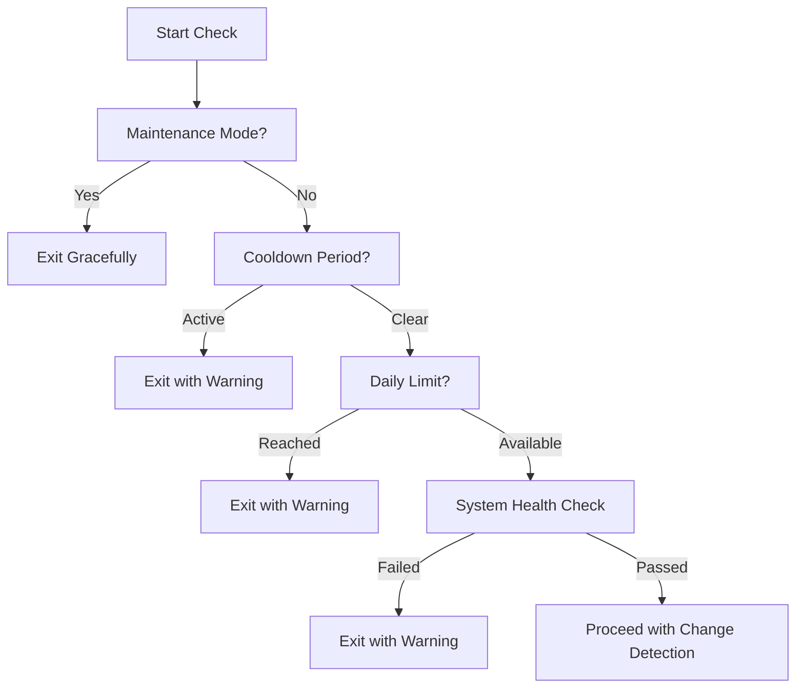
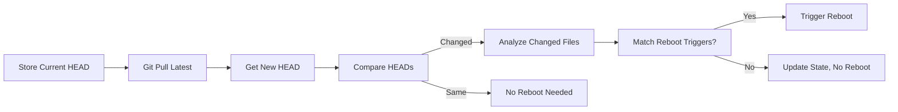
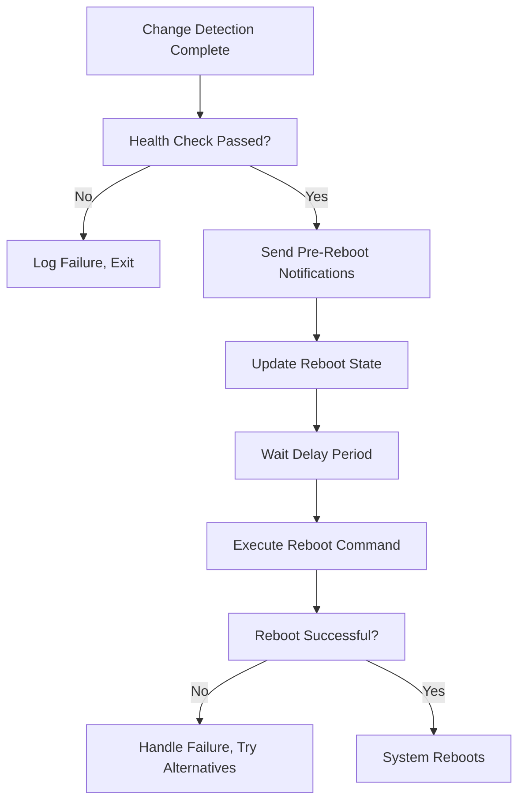

# Auto-Update-Reboot Architecture and Workflow Design

## Overview

This document outlines the architecture and workflow for the auto-update-reboot functionality within the Auto-slopp system. The design provides automated repository change detection with conditional system reboots, comprehensive safety mechanisms, and seamless integration with the existing configuration and logging infrastructure.

## Current System Analysis

### Existing Components Integration
- **Dynamic Script Discovery**: `main.sh` automatically discovers `auto-update-reboot.sh` in the `scripts/` directory
- **Configuration System**: YAML-based configuration through `config.yaml` with `yaml_config.sh`
- **Logging Infrastructure**: Comprehensive logging with `utils.sh` including specialized functions for reboot events
- **Error Handling**: Robust error handling with `setup_error_handling()` and safe command execution
- **State Management**: JSON-based state persistence for tracking reboot history and system health

### Repository Structure
```
Auto-slopp/
├── main.sh                           # Main orchestration (auto-discovers scripts)
├── config.yaml                       # YAML configuration (includes auto-update-reboot settings)
├── scripts/
│   ├── auto-update-reboot.sh         # Auto-update-reboot implementation
│   ├── utils.sh                      # Shared utilities (logging, error handling, reboot functions)
│   ├── yaml_config.sh               # Configuration management
│   └── [other scripts]               # Auto-discovered by main.sh
├── logs/                             # Comprehensive logging directory
│   ├── auto-update-reboot.state      # State persistence for reboot tracking
│   └── [other log files]             # System logs
└── managed_repo_path/                # Target repositories for monitoring
```

## Architecture Design

### 1. Core Script Structure

#### Main Implementation: `auto-update-reboot.sh`
```bash
#!/bin/bash
# Auto-update-reboot script with change detection and conditional reboot

# Architecture layers:
# 1. Configuration and Setup (lines 1-38)
# 2. State Management (lines 40-88) 
# 3. Safety Mechanisms (lines 90-126)
# 4. System Health Checks (lines 128-160)
# 5. Change Detection (lines 162-243)
# 6. Reboot Execution (lines 245-318)
# 7. Main Orchestration (lines 320-357)

SCRIPT_DIR="$(cd "$(dirname "${BASH_SOURCE[0]}")" && pwd)"
source "$SCRIPT_DIR/utils.sh"
source "$SCRIPT_DIR/../config.sh"
```

### 2. Configuration Architecture

#### YAML Configuration Integration
The script integrates with the existing YAML configuration system:

```yaml
# config.yaml - Auto-update-reboot section
auto_update_reboot_enabled: false        # Global enable/disable flag
reboot_cooldown_minutes: 60             # Safety: minimum time between reboots
change_detection_interval_minutes: 5     # Frequency of change checks
reboot_delay_seconds: 30                # Grace period before actual reboot
max_reboot_attempts_per_day: 3          # Daily limit to prevent reboot loops
maintenance_mode: false                  # Manual override for maintenance
emergency_override: false               # Emergency override for forced reboots
```

#### Configuration Loading Strategy
- **Primary Configuration**: Loaded from `config.yaml` via `config.sh` → `yaml_config.sh`
- **Fallback Defaults**: Hard-coded defaults for safety if configuration fails
- **Environment Variables**: Override capability for critical settings
- **Runtime Validation**: Configuration values validated before use

### 3. State Management Architecture

#### State Persistence Design
```json
{
  "last_reboot_timestamp": "2026-01-30T15:30:00+00:00",
  "reboot_attempts_today": 2,
  "current_date": "2026-01-30",
  "last_known_heads": {
    "/path/to/repo1": "abc123...",
    "/path/to/repo2": "def456..."
  },
  "system_health_status": "healthy"
}
```

#### State Management Functions
- **`initialize_state()`**: Creates state file with defaults if not exists
- **`get_state_value()`**: Retrieves specific state values with JSON parsing
- **`set_state_value()`**: Updates state values safely
- **`update_last_known_head()`**: Tracks repository HEAD commits for change detection

#### State File Location
- **Directory**: `${LOG_DIRECTORY}/auto-update-reboot.state`
- **Format**: JSON for human readability and programmatic access
- **Backup Strategy**: State recovery from defaults if corrupted

### 4. Safety Mechanisms Architecture

#### Multi-Layer Safety Design


#### Safety Layer Breakdown

1. **Maintenance Mode Override**
   - Purpose: Manual disable during system maintenance
   - Configuration: `maintenance_mode` in `config.yaml`
   - Behavior: Immediate graceful exit with informational log

2. **Cooldown Period Protection**
   - Purpose: Prevent reboot loops
   - Configuration: `reboot_cooldown_minutes`
   - Implementation: Timestamp-based comparison
   - Behavior: Skip reboot if within cooldown, log remaining time

3. **Daily Limit Enforcement**
   - Purpose: Prevent excessive reboots
   - Configuration: `max_reboot_attempts_per_day`
   - Implementation: Date-based counter with automatic reset
   - Behavior: Skip reboot at daily limit, log warning

4. **System Health Validation**
   - Purpose: Ensure system is in suitable state for reboot
   - Checks: Disk space, memory usage, critical services
   - Behavior: Abort reboot on health check failure, log specifics

### 5. Change Detection Architecture

#### Git Change Detection Workflow


#### Change Detection Implementation

1. **Repository Discovery**
   - Primary repository: `${MANAGED_REPO_PATH}/Auto-slopp`
   - Extensible design for additional repositories
   - Graceful handling of missing repositories

2. **Git Operation Safety**
   - Current HEAD capture before any operations
   - Safe `git pull` with error handling
   - Rollback capability on failures

3. **Change Analysis**
   - File list extraction: `git diff --name-only`
   - Reboot trigger pattern matching
   - Exclusion/inclusion pattern support

#### Reboot Trigger Configuration
```bash
# Current trigger patterns (configurable in future versions)
reboot_triggers=(
    "scripts/*.sh"          # Any script changes
    "config.yaml"           # Configuration changes
    "main.sh"              # Main orchestration changes
    "scripts/utils.sh"      # Core utility changes
)
```

### 6. Logging and Monitoring Architecture

#### Specialized Logging Functions
The script integrates with the existing logging system and adds specialized functions:

- **`log_change_detection()`**: Logs change detection events
- **`log_system_health()`**: Logs health check results
- **`log_reboot_event()`**: Logs reboot scheduling and execution
- **`log_system_state_snapshot()`**: Captures system state before reboot

#### Log Categories
```bash
# Log levels and their usage in auto-update-reboot
INFO     # Normal operations, state changes
WARNING  # Safety triggers, non-critical failures
ERROR    # Critical failures, abort conditions
SUCCESS  # Successful operations (future enhancement)
```

#### System State Capture
Before reboot, the system captures:
- Current timestamp and reason for reboot
- Active processes and services status
- System resource usage (memory, disk, CPU)
- Git repository states
- Recent log entries for context

### 7. Reboot Execution Architecture

#### Reboot Process Flow


#### Reboot Execution Strategy

1. **Pre-Reboot Notifications**
   - System state snapshot logging
   - systemd notifications if available
   - Configurable delay for graceful shutdown

2. **Reboot Command Priority**
   ```bash
   # Preferred order of reboot methods
   1. systemctl reboot      # Modern systemd systems
   2. shutdown -r now       # Traditional Unix/Linux
   3. reboot                # Basic reboot command
   ```

3. **Failure Handling**
   - Alternative method attempts
   - Comprehensive error logging
   - State cleanup on failure

## Integration Points

### Main.sh Integration
```bash
# main.sh automatically discovers and executes auto-update-reboot.sh
# Script runs in alphabetical order among other scripts
# Integration is seamless - no modifications to main.sh required
```

### Configuration System Integration
- **YAML Parser**: Uses existing `yaml_config.sh` infrastructure
- **Environment Variable Expansion**: Supported through `config.sh`
- **Configuration Validation**: Handled by YAML parser with defaults

### Logging System Integration
- **Utils Functions**: All logging uses existing `utils.sh` infrastructure
- **Log Rotation**: Integrated with existing log rotation system
- **Colored Output**: Maintains consistency with other scripts

### State Management Integration
- **Log Directory**: Uses `LOG_DIRECTORY` from configuration
- **File Permissions**: Respects system umask and directory permissions
- **Cleanup**: Potential integration with log cleanup system

## Configuration Parameters Design

### Core Parameters
```yaml
# Enable/Disable Controls
auto_update_reboot_enabled: false    # Master switch
maintenance_mode: false              # Maintenance override
emergency_override: false            # Emergency forced reboot

# Timing Controls
reboot_cooldown_minutes: 60          # Minimum time between reboots
change_detection_interval_minutes: 5 # Check frequency (used by main.sh)
reboot_delay_seconds: 30            # Grace period before reboot

# Safety Limits
max_reboot_attempts_per_day: 3       # Daily reboot limit
```

### Advanced Configuration (Future Extensions)
```yaml
# Repository Monitoring
monitored_repositories:
  - path: "${MANAGED_REPO_PATH}/Auto-slopp"
    name: "auto-slopp"
    reboot_triggers: ["**/*.sh", "config.yaml"]
  
# Health Check Thresholds
health_checks:
  max_disk_usage_percent: 90
  max_memory_usage_percent: 90
  critical_services: ["sshd", "networking"]

# Notification Configuration
notifications:
  pre_reboot_delay_warning: true
  system_state_capture: true
  systemd_notify: true
```

## Error Handling Strategy

### Error Categories and Responses

1. **Configuration Errors**
   - Missing config.yaml: Use defaults, log warning
   - Invalid values: Validate and use fallbacks
   - Permission issues: Log error, exit gracefully

2. **Git Operation Errors**
   - Network failures: Continue with current state
   - Repository corruption: Log error, skip repository
   - Merge conflicts: Log warning, use current HEAD

3. **State Management Errors**
   - File corruption: Reinitialize with defaults
   - Permission issues: Log error, use in-memory state
   - Disk space: Log error, attempt recovery

4. **Reboot Execution Errors**
   - Command not found: Try alternative methods
   - Permission denied: Log error, notify administrator
   - System not responding: Log comprehensive error

### Recovery Mechanisms
- **Graceful Degradation**: Continue operating when possible
- **Default Fallbacks**: Always have safe default values
- **State Recovery**: Rebuild state from defaults if corrupted
- **Retry Logic**: Multiple attempts for transient failures

## Security Considerations

### Attack Surface Mitigation
1. **Configuration Validation**: All inputs validated before use
2. **Command Injection Prevention**: Use of parameterized commands
3. **Privilege Escalation**: Only use necessary privileges
4. **File System Protection**: Check file permissions and paths

### Safe Operations
1. **Git Operations**: Run in repository contexts only
2. **Reboot Commands**: Only use well-known system commands
3. **State File Access**: Validate file paths before access
4. **Log File Handling**: Respect file permissions and quotas

## Monitoring and Observability

### Key Metrics
1. **Reboot Frequency**: Track reboot count and patterns
2. **Change Detection**: Monitor repository change frequency
3. **System Health**: Track health check results over time
4. **Error Rates**: Monitor error frequency and types

### Logging Strategy
1. **Structured Logging**: Consistent log format across all functions
2. **Log Levels**: Appropriate use of INFO, WARNING, ERROR
3. **Correlation IDs**: Track operations across multiple steps
4. **Retention**: Integration with existing log rotation system

### Alerting (Future Enhancement)
1. **Reboot Loop Detection**: Alert on excessive reboots
2. **Health Failures**: Alert on recurring health issues
3. **Configuration Changes**: Alert on critical configuration changes
4. **System Anomalies**: Alert on unusual patterns

## Performance Considerations

### Optimization Strategies
1. **Efficient Git Operations**: Minimize git command usage
2. **State Management**: Use lightweight JSON parsing
3. **Health Checks**: Optimize for fast execution
4. **Change Detection**: Only analyze changed files

### Resource Usage
1. **Memory Usage**: Minimal memory footprint
2. **Disk Usage**: Small state file, efficient logging
3. **Network Usage**: Minimal git pull operations only
4. **CPU Usage**: Lightweight operations

## Testing Strategy

### Unit Testing Approach
1. **Configuration Loading**: Test with various YAML configurations
2. **State Management**: Test state file creation, updates, recovery
3. **Change Detection**: Mock git operations for testing
4. **Safety Mechanisms**: Test all safety check scenarios

### Integration Testing
1. **End-to-End Workflows**: Test complete change detection to reboot
2. **Configuration Integration**: Test with actual config.yaml
3. **Logging Integration**: Verify logging with utils.sh
4. **Error Scenarios**: Test various failure conditions

### Safety Testing
1. **Reboot Loop Prevention**: Attempt to trigger loops safely
2. **Health Check Failures**: Simulate various health issues
3. **Configuration Errors**: Test with invalid configurations
4. **System State Testing**: Test with various system conditions

## Future Enhancements

### Planned Features
1. **Multi-Repository Support**: Monitor multiple repositories simultaneously
2. **Custom Reboot Triggers**: User-configurable file patterns and conditions
3. **Advanced Health Checks**: More comprehensive system health monitoring
4. **Notification Integration**: External alerting systems (email, Slack, etc.)
5. **Rollback Capability**: Automatic rollback on failed post-reboot states

### Extension Points
1. **Custom Health Checks**: Plugin-style health check additions
2. **Alternative Change Detection**: Support for non-git change sources
3. **Custom Reboot Methods**: Support for container orchestration systems
4. **State Backends**: Alternative state storage mechanisms

## Conclusion

The auto-update-reboot architecture provides a robust, safe, and maintainable solution for automated repository monitoring and conditional system reboots. The design prioritizes system safety through multiple layers of protection while maintaining seamless integration with the existing Auto-slopp infrastructure.

Key architectural strengths:
- **Safety First**: Multiple independent safety mechanisms prevent reboot loops
- **Configuration Driven**: Fully configurable through YAML with sensible defaults
- **Integrated Design**: Seamless integration with existing logging and error handling
- **Extensible**: Architecture supports future enhancements without breaking changes
- **Observable**: Comprehensive logging and state tracking for operational visibility

The implementation follows established patterns in the codebase and maintains consistency with the overall system architecture while providing the specialized functionality needed for automated update-reboot operations.