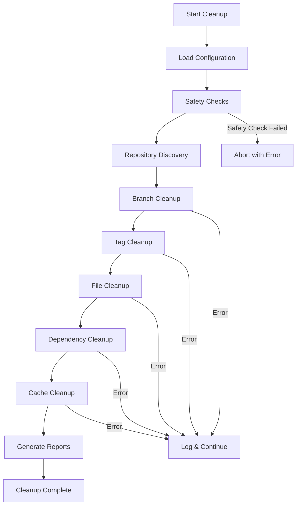
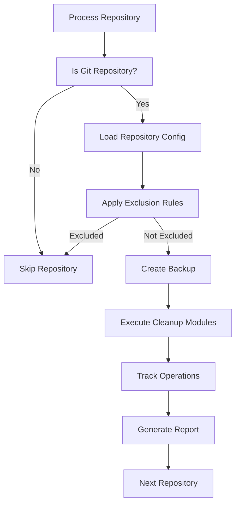

# Repository Cleanup Script Architecture Design

## Overview

This document outlines the architecture for implementing comprehensive repository cleanup functionality within the Auto-slopp system. The design follows established patterns and integrates seamlessly with the existing codebase.

## Current System Analysis

### Existing Components
- **Dynamic Script Discovery**: `main.sh` automatically discovers all `.sh` files in `scripts/` directory
- **Configuration System**: YAML-based configuration with `config.yaml` and `yaml_config.sh`
- **Logging Infrastructure**: Comprehensive logging with `utils.sh` (timestamps, colors, rotation)
- **Error Handling**: Robust error handling with `setup_error_handling()` and safe command execution
- **Git Operations**: Safe git operations through `safe_git()` function
- **Existing Cleanup**: `cleanup-branches.sh` handles branch cleanup as a reference implementation

### Repository Structure
```
Auto-slopp/
├── main.sh                    # Main orchestration (auto-discovers scripts)
├── config.yaml                # YAML configuration
├── scripts/                   # All scripts are auto-discovered
│   ├── utils.sh              # Shared utilities (logging, error handling)
│   ├── yaml_config.sh        # Configuration management
│   ├── cleanup-branches.sh   # Existing branch cleanup (reference)
│   └── [new cleanup scripts] # Will be auto-discovered
├── managed_repo_path/         # Target repositories for cleanup
└── logs/                      # Comprehensive logging
```

## Architecture Design

### 1. Core Cleanup Script Structure

#### Main Cleanup Orchestrator: `repository-cleanup.sh`
```bash
#!/bin/bash
# Main repository cleanup orchestrator
# Coordinates all cleanup operations across multiple repositories

SCRIPT_DIR="$(cd "$(dirname "${BASH_SOURCE[0]}")" && pwd)"
source "$SCRIPT_DIR/utils.sh"
source "$SCRIPT_DIR/../config.sh"

setup_error_handling
export SCRIPT_NAME="repository-cleanup.sh"

log "INFO" "Starting repository cleanup orchestration"

# Load cleanup configuration from config.yaml extensions
# Execute cleanup modules in sequence
# Generate comprehensive cleanup reports
```

#### Configuration Extensions
Add to `config.yaml`:
```yaml
# Repository cleanup configuration
repository_cleanup:
  enabled: true
  cleanup_types:
    - branches           # Clean up stale branches
    - tags              # Clean up old tags  
    - files             # Clean up temporary/large files
    - dependencies      # Clean up unused dependencies
    - cache            # Clean up build caches
    - logs             # Clean up old log files
    - artifacts        # Clean up build artifacts
  
  safety_settings:
    dry_run: false                    # Show what would be done
    backup_before_delete: true        # Create backups before deletion
    protected_branches: [main, master, develop, HEAD]
    protected_tags: [v*, latest, stable]
    max_age_days: 30                  # Default max age for cleanup
    size_threshold_mb: 100           # Size threshold for file cleanup
  
  scheduling:
    cleanup_interval_hours: 24         # How often to run cleanup
    exclude_repos: []                 # Repositories to exclude
    include_patterns: []              # Repo name patterns to include
```

### 2. Modular Cleanup Components

#### A. Branch Cleanup Enhancement: `cleanup-branches-enhanced.sh`
Extend existing `cleanup-branches.sh` with:
- Configuration-driven protected branches
- Age-based cleanup (branches older than X days)
- Stale branch detection (no commits for X days)
- Backup branch creation before deletion
- Integration with main cleanup orchestrator

#### B. Tag Cleanup: `cleanup-tags.sh`
```bash
#!/bin/bash
# Remove old/unreferenced tags
# Functionality:
# - Remove tags older than configured age
# - Keep protected tag patterns (v*, latest, etc.)
# - Backup tags before deletion
# - Handle lightweight vs annotated tags
```

#### C. File Cleanup: `cleanup-files.sh`
```bash
#!/bin/bash
# Clean up temporary and large files
# Functionality:
# - Remove build artifacts (*.class, *.pyc, node_modules, etc.)
# - Clean up log files older than retention period
# - Remove temporary files (*.tmp, *.bak, *~)
# - Handle large files (> size threshold)
# - Git-based cleanup (git clean, git gc)
```

#### D. Dependency Cleanup: `cleanup-dependencies.sh`
```bash
#!/bin/bash
# Clean up unused dependencies
# Functionality:
# - Identify unused npm/pip/cargo dependencies
# - Remove unused lock files
# - Clean up package manager caches
# - Update dependency files
# - Test after cleanup
```

#### E. Cache Cleanup: `cleanup-cache.sh`
```bash
#!/bin/bash
# Clean up various build and tool caches
# Functionality:
# - Clean git object database (git gc)
# - Remove build tool caches (webpack, maven, cargo)
# - Clean Docker images/containers
# - Remove CI/CD artifacts
```

### 3. Shared Cleanup Infrastructure

#### A. Cleanup Configuration Module: `cleanup-config.sh`
```bash
#!/bin/bash
# Configuration management for cleanup operations
# Functions:
# - Load cleanup configuration from YAML
# - Validate cleanup settings
# - Resolve repository patterns
# - Load cleanup rules and policies
```

#### B. Safety & Backup Module: `cleanup-safety.sh`
```bash
#!/bin/bash
# Safety mechanisms for cleanup operations
# Functions:
# - Create backups before deletion
# - Validate safe operations
# - Rollback capabilities
# - Protected item checks
# - Dry run simulation
```

#### C. Reporting Module: `cleanup-reporting.sh`
```bash
#!/bin/bash
# Generate comprehensive cleanup reports
# Functions:
# - Track cleanup operations and results
# - Generate detailed reports (JSON, HTML, text)
# - Send notifications if configured
# - Maintain cleanup history
```

### 4. Integration Points

#### A. Main Script Integration
The cleanup scripts will be automatically discovered by `main.sh` and executed in alphabetical order:
```
01-cleanup-safety.sh          # Safety checks first
02-cleanup-config.sh          # Load configuration
03-cleanup-branches-enhanced.sh # Branch cleanup
04-cleanup-tags.sh            # Tag cleanup  
05-cleanup-files.sh           # File cleanup
06-cleanup-dependencies.sh    # Dependency cleanup
07-cleanup-cache.sh          # Cache cleanup
08-cleanup-reporting.sh       # Generate reports
09-repository-cleanup.sh      # Main orchestrator
```

#### B. Logging Integration
- Use existing `log()` function from `utils.sh`
- Leverage timestamped logging system
- Integrate with log rotation (`rotate_log_if_needed()`)
- Use appropriate log levels (INFO, WARNING, ERROR, SUCCESS)

#### C. Error Handling Integration
- Use `setup_error_handling()` for consistent error handling
- Leverage `safe_execute()` for command execution
- Use `safe_git()` for git operations
- Proper exit codes and error propagation

#### D. Configuration Integration
- Extend `config.yaml` with cleanup-specific settings
- Use `yaml_config.sh` for configuration loading
- Environment variable override support
- Tilde path expansion support

### 5. Workflow Design

#### Cleanup Execution Flow


#### Repository Processing Flow


### 6. Safety Mechanisms

#### Multi-Layer Safety
1. **Configuration Safety**: Protected branches/tags, exclusion rules
2. **Pre-operation Safety**: Dry-run mode, backup creation, validation
3. **Runtime Safety**: Safe command execution, error handling, rollback
4. **Post-operation Safety**: Verification, reporting, audit trail

#### Backup Strategy
```bash
# Backup before deletion
create_backup() {
    local item_type="$1"      # branch, tag, file
    local item_name="$2"      
    local repo_dir="$3"
    
    local backup_dir="${repo_dir}/.cleanup-backup/$(date +%Y%m%d_%H%M%S)"
    mkdir -p "$backup_dir"
    
    case "$item_type" in
        "branch")
            git branch "backup_${item_name}_$(date +%s)" "$item_name"
            ;;
        "tag")
            git tag "backup_${item_name}_$(date +%s)" "$item_name"
            ;;
        "file")
            cp -r "$item_name" "$backup_dir/"
            ;;
    esac
}
```

### 7. Configuration Schema

#### Complete Cleanup Configuration
```yaml
# Add to config.yaml
repository_cleanup:
  # Enable/disable cleanup operations
  enabled: true
  
  # Which cleanup modules to run
  cleanup_types:
    branches: true
    tags: true
    files: true
    dependencies: true
    cache: true
  
  # Safety settings
  safety:
    dry_run: false
    backup_before_delete: true
    require_confirmation: false
    
    # Protection rules
    protected_branches: 
      - main
      - master 
      - develop
      - HEAD
      - release/*
      - hotfix/*
    
    protected_tags:
      - "v*"
      - latest
      - stable
      - release/*
    
    # Age and size thresholds
    max_age_days: 30
    size_threshold_mb: 100
    
    # Exclusion patterns
    exclude_patterns:
      repos:
        - "critical-repo"
        - "backup-*"
      files:
        - "*.important"
        - "config/production/*"
  
  # Module-specific settings
  branches:
    remove_stale: true          # Branches with no commits
    remove_merged: true         # Branches already merged
    stale_days: 30
    keep_last_n: 5              # Keep last N merged branches
  
  tags:
    remove_old: true
    old_days: 90
    keep_pattern: "v*"
  
  files:
    remove_temp_files: true
    remove_build_artifacts: true
    remove_old_logs: true
    log_retention_days: 7
    
    # File patterns to clean
    patterns:
      temp:
        - "*.tmp"
        - "*.bak"
        - "*~"
        - ".DS_Store"
      build:
        - "node_modules"
        - "target"
        - "build"
        - "dist"
        - "*.pyc"
        - "*.class"
      logs:
        - "*.log"
        - "logs/*"
  
  dependencies:
    remove_unused: true
    update_lockfiles: true
    clean_package_manager_cache: true
    
    # Package managers to clean
    package_managers:
      - npm
      - pip
      - cargo
      - maven
      - gradle
  
  cache:
    git_gc: true
    docker_cleanup: true
    ci_artifacts: true
    
    # Cache locations
    paths:
      - "/tmp/*"
      - "~/.cache/*"
      - "var/cache/*"
  
  # Reporting and notifications
  reporting:
    generate_report: true
    report_format: ["json", "text"]
    report_location: "~/cleanup-reports/"
    
    # Notifications (if configured)
    notifications:
      enabled: false
      webhook_url: ""
      email: ""
  
  # Scheduling
  scheduling:
    # When to run cleanup (cron-like)
    schedule: "0 2 * * *"  # Daily at 2 AM
    
    # Interval fallback (used by main.sh loop)
    cleanup_interval_hours: 24
    
    # Time windows for cleanup
    allowed_hours:
      start: 1   # 1 AM
      end: 5     # 5 AM
    
    # Cooldown between cleanup runs
    min_interval_hours: 12
```

### 8. Implementation Strategy

#### Phase 1: Core Infrastructure
1. Create `cleanup-config.sh` - Configuration management
2. Create `cleanup-safety.sh` - Safety mechanisms and backups
3. Create `cleanup-reporting.sh` - Reporting infrastructure
4. Extend `config.yaml` with cleanup configuration

#### Phase 2: Cleanup Modules
1. Enhance `cleanup-branches.sh` → `cleanup-branches-enhanced.sh`
2. Create `cleanup-tags.sh`
3. Create `cleanup-files.sh`
4. Create `cleanup-dependencies.sh`
5. Create `cleanup-cache.sh`

#### Phase 3: Integration
1. Create main `repository-cleanup.sh` orchestrator
2. Update configuration loading in existing scripts
3. Add cleanup configuration validation
4. Integrate with existing logging and error handling

#### Phase 4: Testing & Documentation
1. Create comprehensive tests for each module
2. Add dry-run mode for safe testing
3. Update documentation with cleanup procedures
4. Create migration guide for existing repositories

### 9. Error Handling Strategy

#### Error Categories
1. **Configuration Errors**: Invalid YAML, missing settings
2. **Permission Errors**: Cannot access repositories/files
3. **Git Errors**: Repository corruption, network issues
4. **Space Errors**: Insufficient disk space for backups
5. **Safety Violations**: Attempting to delete protected items

#### Error Recovery
```bash
# Error handling pattern for cleanup operations
cleanup_operation() {
    local operation="$1"
    local repo_dir="$2"
    
    log "INFO" "Starting $operation in $repo_dir"
    
    # Pre-operation checks
    if ! validate_safe_to_proceed "$repo_dir"; then
        log "ERROR" "Safety validation failed for $operation"
        return 1
    fi
    
    # Create backup if configured
    if [[ "$BACKUP_BEFORE_DELETE" == "true" ]]; then
        create_backup "$operation" "$repo_dir"
    fi
    
    # Execute operation with error handling
    if execute_cleanup_operation "$operation" "$repo_dir"; then
        log "SUCCESS" "$operation completed in $repo_dir"
        record_operation_success "$operation" "$repo_dir"
        return 0
    else
        local exit_code=$?
        log "ERROR" "$operation failed in $repo_dir (exit code: $exit_code)"
        record_operation_failure "$operation" "$repo_dir" "$exit_code"
        
        # Attempt rollback if possible
        if [[ "$ENABLE_ROLLBACK" == "true" ]]; then
            attempt_rollback "$operation" "$repo_dir"
        fi
        
        return $exit_code
    fi
}
```

### 10. Monitoring and Metrics

#### Metrics Collection
```bash
# Track cleanup operations
declare -A CLEANUP_METRICS=(
    ["repositories_processed"]=0
    ["branches_cleaned"]=0
    ["tags_cleaned"]=0  
    ["files_cleaned"]=0
    ["dependencies_cleaned"]=0
    ["cache_cleaned"]=0
    ["errors_encountered"]=0
    ["backups_created"]=0
    ["space_freed_mb"]=0
)
```

#### Health Checks
```bash
# Cleanup health monitoring
cleanup_health_check() {
    local issues=()
    
    # Check disk space
    local available_space=$(df / | tail -1 | awk '{print $4}')
    if [[ $available_space -lt 1048576 ]]; then  # Less than 1GB
        issues+=("Low disk space: ${available_space}KB available")
    fi
    
    # Check backup integrity
    if [[ "$BACKUP_BEFORE_DELETE" == "true" ]]; then
        validate_backup_integrity || issues+=("Backup validation failed")
    fi
    
    # Check configuration
    validate_cleanup_config || issues+=("Configuration validation failed")
    
    # Report issues
    if [[ ${#issues[@]} -gt 0 ]]; then
        log "WARNING" "Cleanup health issues detected:"
        for issue in "${issues[@]}"; do
            log "WARNING" "  - $issue"
        done
        return 1
    fi
    
    return 0
}
```

## Benefits of This Architecture

1. **Modular Design**: Each cleanup type is a separate, testable module
2. **Safety First**: Multiple layers of protection prevent accidental data loss
3. **Configuration-Driven**: Flexible configuration through YAML files
4. **Seamless Integration**: Follows existing patterns and integrates perfectly
5. **Comprehensive Reporting**: Detailed reports and audit trails
6. **Error Recovery**: Robust error handling with rollback capabilities
7. **Extensible**: Easy to add new cleanup modules
8. **Performance Tracking**: Metrics and monitoring for operations
9. **Backward Compatible**: Doesn't break existing functionality
10. **Production Ready**: Designed for production environments with proper safeguards

## Next Steps

This architecture provides a comprehensive foundation for implementing repository cleanup functionality. The modular approach allows for incremental implementation while maintaining safety and reliability throughout the process.

The design leverages existing infrastructure while adding powerful new capabilities for maintaining clean, efficient repositories across the managed ecosystem.